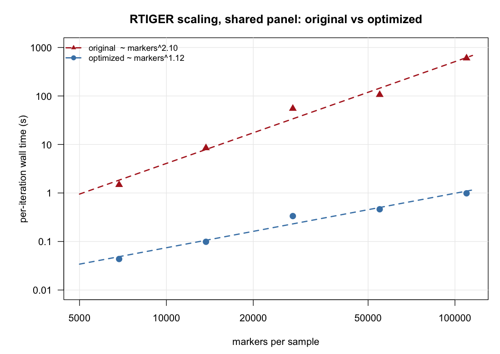

# RTIGER optimization fork — performance notes

This repository — **`faustovrz/RTIGER`** (branch `optimize-julia-core`) — is a
**performance fork** of the original RTIGER,
[`rfael0cm/RTIGER`](https://github.com/rfael0cm/RTIGER). The goal is to make
RTIGER usable on **large populations** — on the order of **1400 samples × ~50 000
markers** — where the upstream implementation is impractically slow and runs out
of memory.

All changes are confined to the Julia core (`inst/julia/rHMM_methods.jl`, the
engine behind the R `JuliaCall` wrapper) plus a thin R-side argument for progress
logging. **The model, the joint fit, the convergence criterion, and the outputs
are unchanged** — every optimization preserves the arithmetic. Equivalence to the
original is validated (see [Correctness](#correctness)).

> TL;DR — same results; the total-fit speed-up **grows with problem size**
> (~34× at 6.9 k markers/sample to **~610× at 110 k**, and widening) because the
> optimized core scales **~O(N)** in markers where the original is **~O(N²)**.
> Peak memory is also made **flat in the number of samples** (projected ~33 GB →
> ~3.6 GB at 1400 samples), plus an opt-in per-iteration progress log so long fits
> report an ETA.

---

## 1. Why the fork

Upstream RTIGER was written and validated for modest sample counts. Two walls
appear at population scale:

1. **Runtime.** A full Baum–Welch (EM) fit is dominated almost entirely
   (~99.97%) by the **emission-distribution M-step**, which rebuilt one
   `BetaBinomial` object per marker on *every* optimizer evaluation. At hundreds
   of thousands of markers this is the bottleneck; the rest of the EM core
   (forward/backward, Viterbi) is secondary but also allocation-heavy.
2. **Peak memory.** `EM()` retained every sample's full per-position arrays
   (`zeta`, `gamma`, `alpha`, `beta`, `psi`) simultaneously and only pooled them
   after the whole E-step. Peak memory therefore grew **linearly in the number
   of samples** (~25 MiB/sample at 50 k markers), projecting to ~33 GB at 1400
   samples.

This fork removes both walls without changing what RTIGER computes.

---

## 2. Summary of gains

**Total fit wall time, optimized vs upstream original**, on one shared marker
panel (§3) — a fixed **6 EM iterations** (the smallest size converged in 5), 3
samples, `eps=0.01`, rigidity 2, native arm64:

| markers / sample (×3 samples) | original | optimized | speed-up |
|---:|---:|---:|---:|
| 6,857   | 7.4 s             | 0.22 s | **~34×** |
| 13,713  | 50.8 s            | 0.59 s | **~86×** |
| 27,426  | 330 s             | 2.0 s  | **~164×** |
| 54,852  | 637 s             | 2.8 s  | **~230×** |
| 109,703 | 3,608 s (~60 min) | 5.9 s  | **~610×** |

The speed-up **grows with problem size** — the optimized core is ~linear in
markers while the original is ~quadratic (§3) — so it widens past 610× beyond
110 k. Memory is a separate axis:

| | before | after | factor |
|---|---|---|---|
| Peak RSS vs #samples | linear (~25 MiB/sample) | **flat (~constant)** | §5 |
| Projected peak RSS @ 1400×50k | ~33 GB | **~3.6 GB** | ~9× |

Data are real *Arabidopsis* Col×Ler allele counts (the BN/Z/AU samples) from the
fitted object of the original repository.

---

## 3. Scaling with markers — shared-panel head-to-head



**How this was produced.** A single shared marker panel was built from the three
real BN/Z/AU samples: the **109,703 loci covered in all three** of them — one
common grid, fully populated, no missing-data padding. That panel was decimated
by odd index four times to give five sizes — **6,857 → 13,713 → 27,426 → 54,852
→ 109,703 markers per sample** (the *same* loci across all samples at every
size). Each size was fit by both the optimized and the upstream original core for
a fixed iteration count (`eps=0.01`, rigidity 2, native arm64), and per-iteration
wall time recorded.

**What it shows.** On a log–log plot the per-iteration time is a straight line
whose slope is the empirical complexity exponent:

- **original ≈ markers²·¹⁰** (R² = 0.98) — roughly **quadratic**, and the top
  doubling (55 k → 110 k) steepens to ~²·⁵, i.e. drifting super-quadratic at
  scale.
- **optimized ≈ markers¹·¹²** (R² = 0.97) — essentially **linear**.

So the optimization removes ~one full factor of N (**O(N²) → O(N)**), which is
why the total-runtime speed-up in §2 widens from ~34× to ~610× across the panel
and keeps growing past it. The lone outlier — the original's 27 k point dipping
below its fit — is the erratic emission-`Optim` evaluation count (the same noise
that makes the original's per-iteration cost jump unpredictably); the optimized
core, having collapsed that work to `O(#distinct (k,n) pairs)`, is smooth.

---

## 4. Time optimization

Each change preserves the exact arithmetic (same summation order where it
matters) and is independently committed.

| Component | Technique | Per-eval speed-up | Commit |
|---|---|---|---|
| **Emission M-step** | Group markers by distinct `(k, n)` once and pre-sum the γ weights, so the `Optim` objective costs `O(#distinct pairs)` instead of `O(#markers)` per evaluation. Low-coverage genotyping data has only a handful of distinct pairs, so this collapses ~`T·states` `BetaBinomial` constructions to a few dozen. | **~1500×** | `16b8a65` |
| **`getlogpsi`** | Memoize the `BetaBinomial` log-pdf over distinct `(k, n)` pairs (same `logpdf` calls → bit-identical values). | ~27× | `d725651` |
| **`productpsi`** | In-place per-state sliding-window cumulative sum (same arithmetic order). | in-place | `d725651` |
| **Viterbi** | Allocation-free in-place scalar argmax for the r-rigid max-product step. | ~12× | `6cf85ca` |
| **forward / backward** | In-place scalar log-sum-exp; ~90× fewer allocations. | ~5× | `44ed85b` |

The emission M-step was **~99.97%** of the original's runtime, so collapsing its
per-evaluation cost from `O(#markers)` to `O(#distinct pairs)` is what bends the
whole fit from ~quadratic to ~linear in markers (§3); the other changes remove
the secondary allocation overhead. These per-evaluation gains compound into the
total-fit speed-ups in §2.

---

## 5. Memory optimization — streaming M-step

**Commit `eb79933`.** The M-step parameter updates depend on the data only
through **pooled sufficient statistics, which are sums**:

- transition ← Σ `zeta`
- start ← Σ `gamma[:,1]`
- emission ← Σ γ-weighted counts grouped by distinct `(k, n)`

Because these are sums, they can be **accumulated incrementally** inside the
E-step loop and each sample's heavy arrays discarded immediately, instead of
hoarding every sample's arrays and pooling at the end. The accumulators fold each
sample in **the same order** the original summed them, so results are
**bit-identical**, not merely close.

A free side effect enabled this: the per-sample `alpha/beta/gamma/psi` arrays
were only ever written to the public `@Probabilities` slot, **which nothing in
the package reads**. They are no longer retained (the slot stays a valid, empty
list), which is what makes constant-memory possible.

**Scaling sweep** (real BN/Z/AU cycled to N samples, 50 k markers each, peak RSS
via `/usr/bin/time -l`):

| N samples | markers | before (linear) | after (streaming) |
|---:|---:|---:|---:|
| 2 | 0.5 M | 562 MiB | 516 MB |
| 4 | 1.0 M | 655 MiB | 533 MB |
| 8 | 2.0 M | 786 MiB | 538 MB |
| 16 | 4.0 M | 917 MiB | 573 MB |
| 30 | 7.5 M | 1252 MiB | 582 MB |

Before: ~25 MiB/sample (linear) → **~33 GB projected at 1400 samples**. After:
~2.3 MB/sample residual — and that residual is just the **input count matrices**
(which must be held), not EM scratch → **~3.6 GB projected at 1400 samples**,
essentially flat in N. (Sweep measured on the x86_64 build; the flat-vs-linear
conclusion is platform-independent.)

A related cleanup (`91911ff`) factors the shared per-chain E-step into a single
`estepChain` helper used by both `EM` and the developer `EMdev`, so the two
cannot drift; behavior is unchanged.

---

## 6. Progress logging (opt-in, default off)

**Commit `c20906f`.** A long fit is otherwise silent. `RTIGER()` / `fit()` gain
a `progress_log` argument: when set to a file path, Julia appends one
newline-terminated record per EM iteration, flushed each iteration so it can be
tailed live to estimate an ETA:

```
iter 12/50  delta=0.0087  eps=0.01  elapsed=1.54  per_iter=0.13  ETA<=4.86
```

- `progress_log = NULL`/`FALSE` (default) → off → **byte-identical** to before,
  regardless of `verbose`.
- `progress_log = "path"` → log there.
- `progress_log = TRUE` → convenience for `file.path(outputdir, "fit_progress.log")`.
- `ETA<=` is an upper bound (the EM usually converges at `delta<eps` before
  `max.iter`).

This is logging only; it does not touch the fit. It is a distinct stream from the
developer `DEBUG`/`debugInfo.txt` dump and from the in-memory `trace` parameter
history.

---

## 7. Correctness

"Optimized ≡ original" was validated from identical initialization:

- **BNZAU15K** (real, 15 k markers, R-default init, `eps=0.01`, r=2):
  **bit-identical** fitted params (to 6 dp) and **all** Viterbi paths.
- **AAACB5K** (real extdata, deterministic init): identical params and Viterbi.
- A synthetic equivalence harness is **bit-identical** to its committed
  baseline.
- The streaming M-step and the `progress_log=off` path were each re-checked to
  remain **bit-identical** after their changes.

Where summation order is genuinely reordered (only at very large scale with a
non-default init) params can differ by ~1e-6, with Viterbi still identical —
mathematically the same statistic, just a different float-add order.

---

## 8. Reproducing

The scaling figure (§3) and the head-to-head numbers (§2) come from the
**shared-panel marker sweep**: build the panel of loci covered in all three
samples, decimate it by odd index to the five sizes, and time both cores at each
size for a fixed iteration count. Those sweep scripts, the equivalence suite (the
15 k bit-identical A/B fit and the synthetic harness against its committed
baseline), and the peak-RSS scaling sweep were run from the `optimize-julia-core`
development workspace and are not shipped with the package.

---

## 9. Notes / gotchas

- **Production defaults:** R's `RTIGER()` uses `eps = 0.01` (overrides Julia's
  `1e-5`); the 3-state label order is fixed pat/het/mat = 1/2/3, so the
  pat-ordered init is `alpha=[20,20,1]`, `beta=[1,20,20]`.
- **Architecture:** on Apple Silicon, use a **native arm64 Julia** matching the
  arm64 R that drives `JuliaCall`; an x86_64 Julia under Rosetta runs but is
  slower.
- **`@Probabilities`:** now an (intentionally) empty public slot — nothing in the
  package consumed it. Note for any downstream code that inspected it directly.
