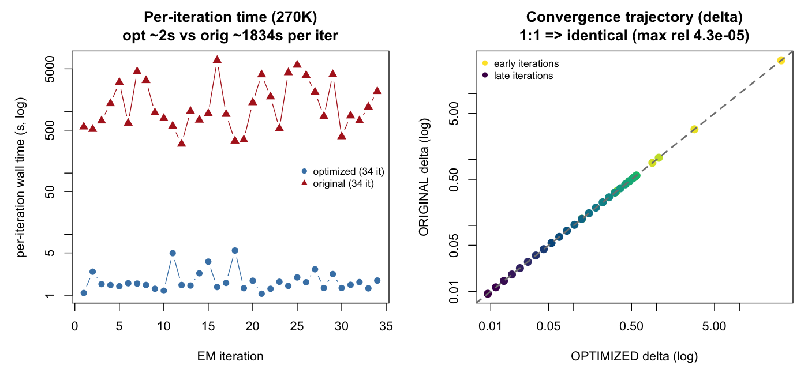

This notebook documents how `time_performance_270K.png` (used in
[`../optimization.md`](../optimization.md), §3) was produced. It is a record of
the plotting step, kept **un-evaluated** (`eval: false`) — the two input logs are
full-resolution fit artifacts from the development workspace and are not shipped
with the package, so the chunk is shown for provenance rather than re-run here.

## Inputs

Two per-iteration progress logs, one from each core, written by the opt-in
`progress_log` argument (one newline-terminated record per EM iteration):

```
iter 12/50  delta=0.0087  eps=0.01  elapsed=1.54  per_iter=0.13  ETA<=4.86
```

- `log_OPT_270K_full.log`  — optimized Julia core
- `log_ORIG_270K_full.log` — upstream original core

Both were run on the same BNZAU270K fit (3 samples × ~270K markers/sample,
R-default init, `eps = 0.01`, rigidity 2, native arm64) from identical
deterministic initialization.

## Plotting

```{r}
#| eval: false
# read one numeric field (f) from the "iter ..." records of a progress log
rd <- function(lf, f) {
  ln <- grep("^iter ", readLines(lf), value = TRUE)
  as.numeric(sub(paste0(".*", f, "=([0-9.eE+-]+).*"), "\\1", ln))
}

elO <- rd("data/log_ORIG_270K_full.log", "elapsed")  # cumulative wall time, original
elP <- rd("data/log_OPT_270K_full.log",  "elapsed")  # cumulative wall time, optimized
dO  <- rd("data/log_ORIG_270K_full.log", "delta")    # convergence delta, original
dP  <- rd("data/log_OPT_270K_full.log",  "delta")    # convergence delta, optimized

piO <- diff(c(0, elO))                 # per-iteration time = first difference
piP <- diff(c(0, elP))
n    <- min(length(dO), length(dP))
drel <- max(abs(dO[1:n] - dP[1:n]) / pmax(abs(dP[1:n]), 1e-12))  # max relative delta gap

png("time_performance_270K.png", width = 1400, height = 640, res = 130)
par(mfrow = c(1, 2), mar = c(4.4, 4.8, 3.4, 1))

# Left panel: per-iteration wall time (log scale), both cores
plot(seq_along(piP), piP, log = "y", type = "b", pch = 19, col = "steelblue",
     ylim = range(c(piO, piP)),
     xlab = "EM iteration", ylab = "per-iteration wall time (s, log)",
     main = sprintf("Per-iteration time (270K)\nopt ~%.0fs vs orig ~%.0fs per iter",
                    mean(piP), mean(piO)))
points(seq_along(piO), piO, type = "b", pch = 17, col = "firebrick", cex = 1.2)
legend("right",
       c(sprintf("optimized (%d it)", length(piP)),
         sprintf("original (%d it)",  length(piO))),
       col = c("steelblue", "firebrick"), pch = c(19, 17), bty = "n", cex = 0.8)

# Right panel: original delta vs optimized delta on a log-log 1:1 line
rng  <- range(c(dO[1:n], dP[1:n]))
cols <- rev(hcl.colors(n, "viridis"))
plot(dP[1:n], dO[1:n], log = "xy", pch = 19, col = cols, cex = 1.3,
     xlim = rng, ylim = rng,
     xlab = "OPTIMIZED delta (log)", ylab = "ORIGINAL delta (log)",
     main = sprintf("Convergence trajectory (delta)\n1:1 => identical (max rel %.1e)", drel))
abline(0, 1, col = "grey50", lty = 2, lwd = 2)
legend("topleft", c("early iterations", "late iterations"),
       pch = 19, col = c(cols[1], cols[n]), bty = "n", cex = 0.8)
dev.off()

cat(sprintf("orig %d iters, opt %d iters, delta max rel=%.2e\n",
            length(piO), length(piP), drel))
```

## Result



Both cores converge in **34 iterations**. The optimized core holds ~1.9 s/iter
against the original's ~1834 s/iter (≈966× over the full fit), and every δ point
lies on the 1:1 line (max relative difference ~4e-5) — the same convergence path,
differing only by float-summation order, not algorithm.